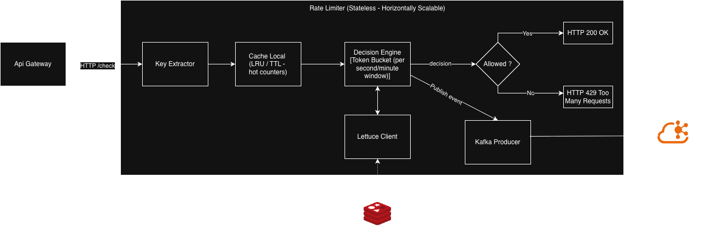

# Architecture — Distributed Rate Limiter Platform

## Overview
A distributed rate limiter platform that enforces per-key request limits
across multiple gateway instances, designed to sustain 10,000 requests
per second per instance with sub-5ms p99 decision latency.

Public APIs face two operational challenges: protecting backend services from accidental 
traffic spikes (legitimate clients misbehaving), and enforcing fair usage across tenants in multi-tenant scenarios. 
Centralized rate limiters become bottlenecks; per-instance limiters drift apart. A production-grade rate limiter must 
reconcile both: low-latency local decisions with globally consistent state.

The platform adopts a stateless gateway tier that makes rate-limit decisions against a sliding window token 
bucket maintained in a local cache, with eventual consistency to a shared Redis state via Kafka. This trades 
brief moments of over-limit allowance (bounded by sub-500ms lag SLO) 
for horizontal scalability and sub-5ms p99 decision latency, enabling high-throughput APIs to enforce 
per-tenant limits without becoming a bottleneck.

## System diagram

## Component diagram — Rate Limiter Service

This diagram zooms into the Rate Limiter Service, following the C4 Component
level. External actors (API Gateway as caller, Redis as shared state, Kafka
as event log) are shown at the boundary for context but are not part of this
service.

Key flow:
1. The API Gateway calls `/check` over HTTP
2. The Key Extractor resolves the rate-limit key from request metadata
3. The Decision Engine consults the local Caffeine cache (hot path)
4. On cache miss, the Lettuce Client falls back to Redis for global state
5. The Kafka Producer publishes a consumption event regardless of the decision
6. The decision (allow/deny) is returned as HTTP 200 or HTTP 429

## Components

### API Gateway
- Role: edge ingress; routes traffic and enforces rate limit decisions
- Stack: Spring Cloud Gateway WebMVC, Java 21 Virtual Threads
- Repository: [distributed-rate-limiter-api-gateway](https://github.com/edineigoncalves/distributed-rate-limiter-api-gateway)

### Rate Limiter Service 
- Role: rate-limit decision engine; owns the sliding window token bucket
- Stack: Spring Boot, Caffeine (local cache), Lettuce (Redis client)
- Repository: [distributed-rate-limiter-service](https://github.com/edineigoncalves/distributed-rate-limiter-service)

### Async Counter Processor 
- Role: consumes rate-limit events from Kafka, updates global counters in Redis
- Stack: Spring Boot, Spring Kafka, Lettuce
- Repository: [distributed-rate-limiter-async-counter-processor](https://github.com/edineigoncalves/distributed-rate-limiter-async-counter-processor)

### Shared infrastructure
- Redis: distributed counter store + optional read path for global state
- Kafka: event log for counter increments
- Prometheus + Grafana: metrics and dashboards

## Key design properties

### Horizontal scalability
The Rate Limiter Service is stateless: each instance can be added or
removed without coordination with other instances. Shared state lives
outside the service — in Redis (authoritative counter store) and Kafka
(in-flight consumption events) — while each instance maintains a local
Caffeine cache as a read-side optimization. Because the cache is a
non-authoritative copy of state, divergence between instance caches is
acceptable and is reconciled eventually through Redis. Adding capacity
is therefore a matter of running additional instances behind a load
balancer; throughput scales near-linearly with instance count.

### Eventual consistency
Rate-limit decisions are made against the local Caffeine cache without
waiting for cross-instance coordination. Each consumption event is
published to Kafka and asynchronously applied to the shared Redis
counter store by the Async Counter Processor, with a target lag SLO of
sub-500ms. During this propagation window, multiple instances may
independently decide based on slightly stale local state, allowing
brief over-limit bursts at the system boundary. This is an explicit
trade-off: the platform accepts bounded inconsistency in exchange for
sub-5ms p99 decision latency and linear horizontal scalability — an
AP choice over strong consistency under the CAP model.

### Fault tolerance1
The platform degrades gracefully when shared infrastructure becomes
unavailable. When Redis is unreachable, the Rate Limiter falls open:
decisions are made against the local Caffeine cache with an aggressive
read timeout (5ms), and unknown keys are allowed through rather than
blocked. The rationale is that a rate limiter that fails closed becomes
itself the bottleneck it was designed to prevent.

When Kafka is unavailable, consumption events are buffered locally and
retried with exponential backoff. Events that exceed the retry budget
are routed to a dead-letter queue (DLQ) for later inspection, preserving
operational visibility without blocking the decision path. To prevent
double-counting on retry, each event carries a UUID; the Async Counter
Processor deduplicates against recently seen IDs before applying
increments to Redis.

### Observability
The platform exposes three observability surfaces: metrics, structured
logs, and distributed traces.

Metrics are exported in Prometheus format from all services and
visualized in Grafana. The core signals are: decision latency
(p50/p95/p99) to validate the sub-5ms SLO, throughput (RPS per instance)
to validate capacity, allow/deny rate to confirm rate-limit behavior,
cache hit rate on the Caffeine layer to validate the hot path, Kafka
consumer lag on the Async Counter Processor to validate the sub-500ms
consistency SLO, and infrastructure health (Redis, Kafka, per-instance
up/down).

Logs are structured (JSON) to enable filtering, aggregation, and
alerting on fields such as request id, tenant, decision outcome, and
rate-limit key. Text-based logs are not used.

Distributed tracing is instrumented with OpenTelemetry from day one,
propagating trace context across the API Gateway, Rate Limiter Service,
and Async Counter Processor. Traces enable end-to-end visibility from
inbound HTTP request through the decision path, Kafka event publication,
and asynchronous counter consolidation in Redis.

## Architecture decisions
Major architectural choices are documented as ADRs. See:
- [ADR-0001: Platform baseline — Spring Boot 4.0](adr/0001-platform-baseline-spring-boot-4.md)
- [ADR-0002: Multi-repository structure](adr/0002-repository-structure.md)
- [ADR-0003: Rate-limit check contract — HTTP/REST v1](adr/0003-rate-limit-check-contract-http-v1.md)

Additional ADRs will be added as decisions are made during implementation.