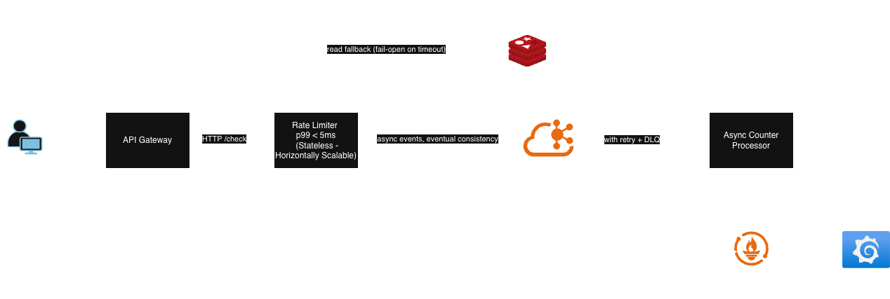

# Architecture — Distributed Rate Limiter Platform

## Overview
A distributed rate limiter platform that enforces per-key request limits
across multiple gateway instances, designed to sustain 10,000 requests
per second per instance with sub-5ms p99 decision latency.

Public APIs face two operational challenges: protecting backend services from accidental 
traffic spikes (legitimate clients misbehaving), and enforcing fair usage across tenants in multi-tenant scenarios. 
Centralized rate limiters become bottlenecks; per-instance limiters drift apart. A production-grade rate limiter must 
reconcile both: low-latency local decisions with globally consistent state.

The platform adopts a stateless gateway tier that makes rate-limit decisions against a sliding window token 
bucket maintained in a local cache, with eventual consistency to a shared Redis state via Kafka. This trades 
brief moments of over-limit allowance (bounded by sub-500ms lag SLO) 
for horizontal scalability and sub-5ms p99 decision latency, enabling high-throughput APIs to enforce 
per-tenant limits without becoming a bottleneck.

## System diagram

## Components

### API Gateway
- Role: edge ingress; routes traffic and enforces rate limit decisions
- Stack: Spring Cloud Gateway WebMVC, Java 21 Virtual Threads
- Repository: [distributed-rate-limiter-api-gateway](https://github.com/edineigoncalves/distributed-rate-limiter-api-gateway)

### Rate Limiter Service 
- Role: rate-limit decision engine; owns the sliding window token bucket
- Stack: Spring Boot, Caffeine (local cache), Lettuce (Redis client)
- Repository: [distributed-rate-limiter-service](https://github.com/edineigoncalves/distributed-rate-limiter-service)

### Async Counter Processor 
- Role: consumes rate-limit events from Kafka, updates global counters in Redis
- Stack: Spring Boot, Spring Kafka, Lettuce
- Repository: [distributed-rate-limiter-async-counter-processor](https://github.com/edineigoncalves/distributed-rate-limiter-async-counter-processor)

### Shared infrastructure
- Redis: distributed counter store + optional read path for global state
- Kafka: event log for counter increments
- Prometheus + Grafana: metrics and dashboards

## Key design properties

### Horizontal scalability
Pending. To be drafted in a future session.

### Eventual consistency
Pending. To be drafted in a future session.

### Fault tolerance
Pending. To be drafted in a future session.

### Observability
Pending. To be drafted in a future session.

## Architecture decisions
Major architectural choices are documented as ADRs. See:
- [ADR-0001: Platform baseline — Spring Boot 4.0](adr/0001-platform-baseline-spring-boot-4.md)
- [ADR-0002: Multi-repository structure](adr/0002-repository-structure.md)

Additional ADRs will be added as decisions are made during implementation.